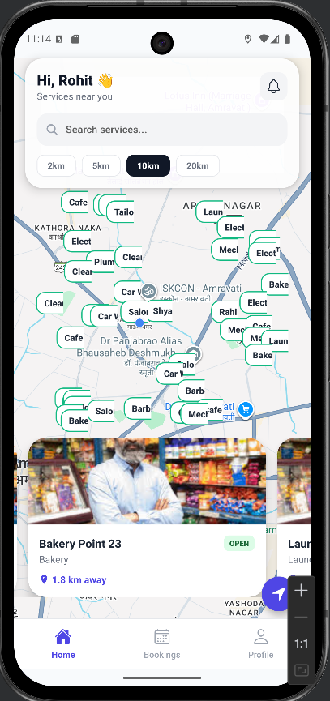
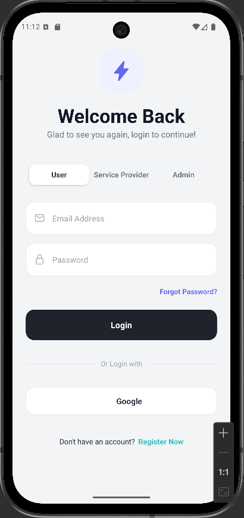
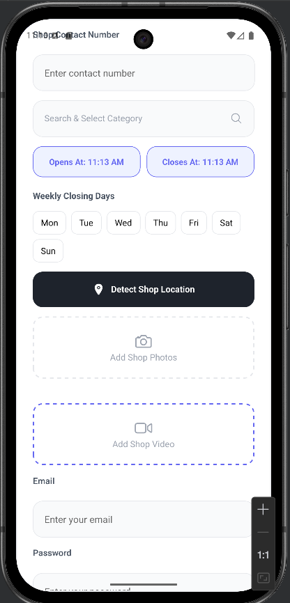
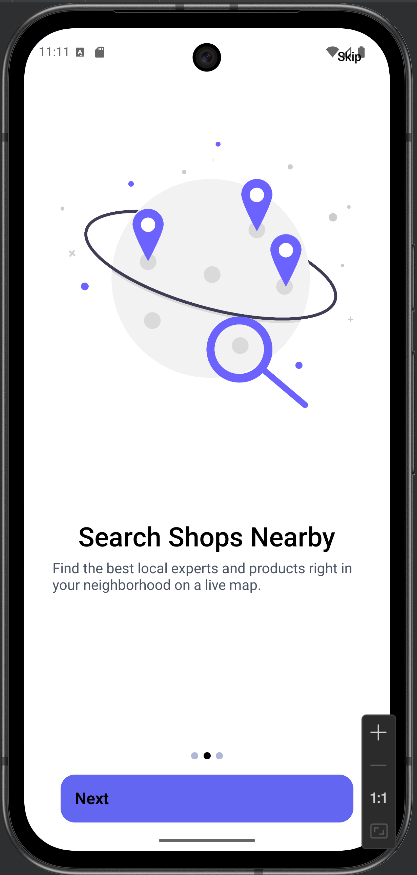

# Commerce App

A modern mobile commerce platform built with React Native and Expo that connects service providers with customers through an intuitive marketplace interface.

## 🚀 Features

### User Features
- **Service Discovery**: Browse and search for local services on interactive maps
- **Booking System**: Easy appointment scheduling with service providers
- **User Profiles**: Personal account management with editable information
- **Order Tracking**: Real-time status updates for bookings
- **Location Services**: GPS-based service discovery and navigation

### Service Provider Features
- **Business Dashboard**: Manage shop information and services
- **Booking Management**: Accept/reject customer appointments
- **Profile Customization**: Update business details and operating hours
- **Service Listings**: Create and manage service offerings

### Admin Features
- **User Management**: Oversee all accounts and permissions
- **Content Moderation**: Manage listings and reviews
- **Analytics Dashboard**: Track platform metrics and performance

## 🛠️ Tech Stack

### Frontend
- **React Native** - Mobile application framework
- **Expo** - Development platform and toolchain
- **React Navigation** - Routing and navigation
- **Redux Toolkit** - State management
- **AsyncStorage** - Local data persistence

### Backend & Services
- **Firebase Authentication** - User authentication and authorization
- **Cloud Firestore** - NoSQL database for real-time data
- **Firebase Cloud Storage** - Image and file storage
- **Google Maps API** - Location services and mapping

### UI & Styling
- **React Native Elements** - Pre-built UI components
- **Ionicons** - Icon library
- **Custom Typography System** - Consistent text styling
- **Responsive Design** - Adaptive layouts for all screen sizes

## 📱 Screenshots

<div align="center">
  
  
  
    
</div>

## 🏗️ Architecture

### Project Structure
```
commerce/
├── app/                    # Main application code
│   ├── (admin)/           # Admin-specific screens
│   ├── (tabs)/            # Tab navigation layouts
│   ├── (user)/            # User-specific screens
│   ├── auth/              # Authentication flows
│   ├── bookings/          # Booking management
│   ├── Components/        # Shared UI components
│   ├── services/          # Service-related screens
│   └── _layout.js         # Root layout configuration
├── hooks/                 # Custom React hooks
├── store/                 # Redux store configuration
├── utils/                 # Utility functions
└── constants/             # Application constants
```

### State Management
The app uses Redux Toolkit with AsyncStorage persistence for:
- Authentication state
- User profile data
- Onboarding completion status
- Notification preferences

### Navigation Flow
```
Onboarding → Authentication → Role-based Dashboard
├── User: Home → Services → Bookings → Profile
├── Admin/Shopkeeper: Dashboard → Services → Bookings → Profile
└── Super Admin: Admin Panel → User Management
```

## 🔧 Getting Started

### Prerequisites
- Node.js (v16 or higher)
- npm or yarn
- Expo CLI
- Android Studio / Xcode (for device simulation)

### Installation

1. **Clone the repository**
```bash
git clone <repository-url>
cd commerce
```

2. **Install dependencies**
```bash
npm install
# or
yarn install
```

3. **Start the development server**
```bash
npx expo start
```

4. **Run on device/emulator**
- Scan QR code with Expo Go app
- Or press `a` for Android emulator
- Or press `i` for iOS simulator

### Environment Variables
Create a `.env` file in the root directory:
```env
# Firebase Configuration
FIREBASE_API_KEY=your_api_key
FIREBASE_AUTH_DOMAIN=your_auth_domain
FIREBASE_PROJECT_ID=your_project_id
FIREBASE_STORAGE_BUCKET=your_storage_bucket
FIREBASE_MESSAGING_SENDER_ID=your_messaging_sender_id
FIREBASE_APP_ID=your_app_id

# Google Maps API
GOOGLE_MAPS_API_KEY=your_maps_api_key

# Cloudinary (if used)
CLOUDINARY_CLOUD_NAME=your_cloud_name
CLOUDINARY_API_KEY=your_api_key
CLOUDINARY_API_SECRET=your_api_secret
```

## 🎯 Key Components

### Authentication System
- Email/password and Google OAuth support
- Role-based access control (User/Admin/Shopkeeper/Super Admin)
- Secure token management with automatic refresh

### Booking Workflow
1. User discovers services via map/search
2. Selects service and chooses date/time
3. Submits booking request
4. Provider receives notification and can accept/decline
5. User receives confirmation and booking details

### Data Persistence
- **Redux Store**: Application state management
- **AsyncStorage**: Offline data caching
- **Firebase Firestore**: Real-time database synchronization
- **Cloud Storage**: Media file hosting

## 📊 Performance Optimizations

- **Lazy Loading**: Components loaded on demand
- **Image Optimization**: Compressed assets and caching
- **Code Splitting**: Bundle size reduction
- **Memoization**: Prevent unnecessary re-renders
- **Geolocation Caching**: Reduced API calls for location services

## 🔒 Security Features

- **Authentication Guards**: Protected routes based on user roles
- **Data Validation**: Client and server-side input validation
- **Secure Storage**: Encrypted sensitive data
- **Rate Limiting**: API request throttling
- **Session Management**: Automatic logout on inactivity

## 🤝 Contributing

1. Fork the repository
2. Create your feature branch (`git checkout -b feature/AmazingFeature`)
3. Commit your changes (`git commit -m 'Add some AmazingFeature'`)
4. Push to the branch (`git push origin feature/AmazingFeature`)
5. Open a Pull Request

### Development Guidelines
- Follow the existing code style and patterns
- Write meaningful commit messages
- Test thoroughly before submitting PRs
- Update documentation when adding new features

## 🐛 Troubleshooting

### Common Issues

**Metro Bundler Errors**
```bash
# Clear cache and restart
npx expo start -c
```

**Firebase Connection Issues**
- Verify environment variables are correctly set
- Check Firebase project configuration
- Ensure proper API keys and permissions

**Location Services Not Working**
- Grant location permissions in device settings
- Check Google Maps API key configuration
- Verify network connectivity

## 📱 Deployment

### Building for Production

**Android**
```bash
npx expo build:android
```

**iOS**
```bash
npx expo build:ios
```

### Publishing Updates
```bash
npx expo publish
```

## 📄 License

This project is licensed under the MIT License - see the [LICENSE](LICENSE) file for details.

## 🙏 Acknowledgments

- [React Native](https://reactnative.dev/) - Mobile framework
- [Expo](https://expo.dev/) - Development platform
- [Firebase](https://firebase.google.com/) - Backend services
- [Google Maps](https://developers.google.com/maps) - Mapping services
- All the open-source libraries and contributors that made this project possible

## 📞 Support

For support, email [your-email@example.com] or join our Slack channel.

---
<p align="center">Made with ❤️ using React Native and Expo</p>